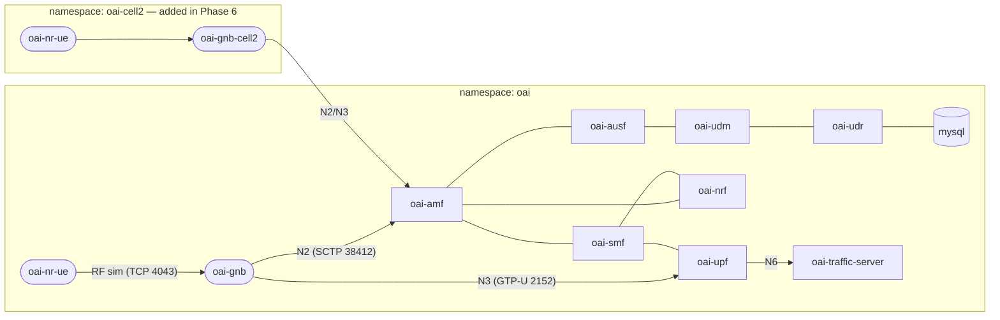

# 5G RAN on Kubernetes — Implementation Plan

Deploy a complete 5G network (OAI core + gNB + UE) on Kubernetes, learn to scale it
up/down, and prepare the path to NVIDIA Aerial for GPU-accelerated L1.

There are two tracks. Pick by what hardware you have:

- **Track A — learn the Kubernetes side on any x86 box** (scripts `00`–`06`).
  OAI core + gNB + UE in RF-simulator mode: no radio, no GPU, no special NIC.
  This is where the scaling exercises live.
- **Track B — the real GPU-accelerated RAN** (scripts `20`–`22`). NVIDIA Aerial
  L1 + OAI L2/L3 + a dApp, on an Aerial-capable host with an O-RAN 7.2 radio.
  Start at [docs/VERSIONS.md](docs/VERSIONS.md) — version pairing is the thing
  that will bite you.

```
aerial-k3s/
├── README.md            ← you are here (the plan)
├── versions.env         ← pinned, mutually-validated version set
├── docs/
│   ├── VERSIONS.md      ← verified matrix + what is NOT verified. Read first.
│   └── AERIAL.md        ← how Aerial slots in under an OAI L2
├── scripts/
│   ├── 00–06            ← Track A: tools → cluster → core → RAN → verify → scale
│   ├── 10, 11, 12       ← inspect an existing deployment (read-only, redacted)
│   ├── 20-preflight.sh  ← Track B: is this host Aerial-ready? (read-only)
│   ├── 21-fetch-stack.sh← Track B: pull Aerial image + OAI + dApp sources
│   ├── 22-build-dapp.sh ← Track B: build/run the PRB-Power reference dApp
│   ├── install-guardrails.sh ← pre-commit hook blocking site data
│   └── fetch-charts.sh  ← pulls the upstream OAI charts (auto-run)
├── values/              ← Helm value overrides
├── site/                ← UNTRACKED: your deployment's values
├── orchestration/       ← NOT in git: OAI Helm charts, fetched on demand
└── stack/               ← NOT in git: Aerial + OAI + sample-app sources
```

## Track B quick start

Host preparation — driver, kernel, DOCA/OFED, hugepages, CPU isolation, NIC
firmware, PTP — is **out of scope** here: it is done once per box from NVIDIA's
install guide. Everything from the RAN software up is fetched from scratch.

```bash
./scripts/20-preflight.sh      # is the host Aerial-ready? changes nothing
./scripts/21-fetch-stack.sh    # Aerial image (pulls anonymously) + OAI + dApp sources
cp site.example.yaml site/site.yaml && $EDITOR site/site.yaml
./scripts/31-build-stack.sh    # compile L1, build the L2 image — all from stack/
./scripts/32-install-k3s.sh    # cluster, pinned off the isolated cores
./scripts/33-render-config.sh  # site.yaml + upstream templates -> site/rendered/
./scripts/22-build-dapp.sh     # optional: PRB-Power dApp over the E3 interface
```

**Portability is the point.** Everything above works on a bare server: the
sources are version-pinned clones, the tools install themselves, and every
site-specific value comes from `site/site.yaml`. Given the same `site.yaml`, two
different servers render byte-identical configs. Nothing is copied out of an
existing deployment and nothing is assumed to be lying around on the box.

`30-harvest-params.sh` is the one exception, and it is **optional**: on a host
that already ran this stack, it reads the parameter *values* out of the old
configs to save you transcribing them. It copies no files. On a new site you
fill in `site/site.yaml` by hand and never run it.

## Site-specific configuration

This repo is **public and vendor-neutral** — it must work on any Aerial-capable
host, not one particular lab. Anything that identifies a deployment (fronthaul
MAC and VLAN, PCIe addresses, cell identity, management IPs, NGC credentials,
kubeconfigs) belongs in the untracked `site/` directory, never in a tracked file.

Install the guardrail once per clone:

```bash
./scripts/install-guardrails.sh
```

It adds a pre-commit hook that refuses to commit MAC addresses, PCIe IDs, NGC
keys, private keys, or inventory captures, and it self-tests on install. For a
genuine false positive, `git commit --no-verify`.

The inventory scripts (`10`, `11`, `12`) write outside the repo and their output
is gitignored — but treat it as sensitive: it describes your network.

---

## 0. Reality check: Aerial vs OAI

| | OAI gNB (this plan) | NVIDIA Aerial cuBB |
|---|---|---|
| L1 (PHY) | CPU (x86, AVX2) | GPU (cuPHY) |
| Hardware needed | Any x86 server | A supported NVIDIA platform — data-center GPU (A100/H100/GH200), a converged card (A100X/H100‑CX7), or a Grace‑Blackwell system such as GB10 — plus a ConnectX‑6/7-class NIC and PTP grandmaster |
| Radio | RF simulator (no radio needed), USRP, or O‑RAN 7.2 RU | O‑RAN 7.2 RU only |
| Distribution | Public Docker Hub | NVIDIA NGC (requires NVIDIA developer/Aerial program access) |

Aerial **cannot** run on GeForce cards. The plan below builds the whole network with
OAI in RF‑simulator mode (zero special hardware), and [docs/AERIAL.md](docs/AERIAL.md)
explains exactly what changes when you get Aerial‑capable hardware — the core and the
Kubernetes skills transfer 1:1, because Aerial replaces **only the L1** under an OAI L2/L3.

## 1. Target architecture



- Every network function is one Helm release → one Deployment → pod(s) + ClusterIP
  service. Pods find each other by **service DNS name** (`oai-amf`, `oai-ran`, …).
- The UE is a real OAI UE binary; the radio link is simulated over TCP
  ("rfsim"), so the whole stack runs on any machine.
- **Scale-out** = install another gNB release in its own namespace pointing at the
  same AMF (exactly how one core serves many cell sites in production).

## 2. Server prerequisites

- Ubuntu 22.04/24.04 (or similar), x86_64 with **AVX2** (`grep -o avx2 /proc/cpuinfo | head -1`)
- ≥ 8 CPU cores, ≥ 16 GB RAM, ≥ 40 GB free disk
- Docker installed and your user in the `docker` group (`docker ps` works without sudo)
- Internet access (pulls ~4 GB of images on first run)

On the server:

```bash
git clone https://github.com/2YoY2/aerial-k3s.git && cd aerial-k3s
```

The deploy scripts fetch the upstream OAI charts themselves on first run.

## 3. The phases

Run the scripts in order from the `kube/` folder. Each is short and commented —
**read them before running**; that's where the learning is.

| Phase | Script | What it does | Rough time |
|---|---|---|---|
| 1 | `scripts/00-install-tools.sh` | kubectl + helm + minikube into `~/.local/bin` | 2 min |
| 2 | `scripts/01-create-cluster.sh` | Start a k8s cluster (metrics-server enabled for HPA) | 3 min |
| 3 | `scripts/02-deploy-core.sh` | OAI 5G core (`oai-5g-basic` umbrella chart) | 5–10 min |
| 4 | `scripts/03-deploy-ran.sh` | gNB + UE in RF-sim mode | 5 min |
| 5 | `scripts/04-verify.sh` | Prove end-to-end: UE registered, IP assigned, traffic flows | 1 min |
| 6 | `scripts/05-scale-out-cell2.sh` | Add a 2nd gNB + UE (new cell) against the same core | 5 min |
| — | `scripts/06-scale-in.sh` | Remove cell2 (scale back down) | 1 min |
| — | `scripts/99-teardown.sh` | Nuke everything | 1 min |

### Phase 2 — cluster

`minikube` (docker driver) gives you a disposable single-node cluster: perfect for
learning, trivial to rebuild. Knobs: `CPUS=8 MEMORY=12g ./scripts/01-create-cluster.sh`.

> Production-shaped alternative: `k3s` (single binary, systemd service, survives
> reboots): `curl -sfL https://get.k3s.io | sh -` then
> `export KUBECONFIG=/etc/rancher/k3s/k3s.yaml`. All later scripts work unchanged.

### Phase 3 — core network

Installs the `oai-5g-basic` **umbrella chart**: mysql (subscriber DB), NRF, UDR, UDM,
AUSF, AMF, SMF, UPF, LMF + a traffic server behind the UPF for testing. Multus is
disabled — all interfaces (N2/N3/N4/SBI) ride the pod's default `eth0`, which is
exactly right for a lab cluster.

Things worth studying afterwards:

```bash
kubectl get pods -n oai                                  # everything Running?
kubectl logs -n oai deploy/oai-amf | tail -30            # AMF state
kubectl get svc -n oai                                   # the service names = the "network"
kubectl exec -n oai deploy/mysql -- mysql -uroot -plinux -e \
  "SELECT ueid FROM oai_db.AuthenticationSubscription;"  # provisioned SIMs
```

The test SIMs (IMSI `001010000000100`/`101`, key `fec86ba6...`, OPC `C42449...`)
are pre-loaded in mysql, and the UE chart defaults match them. PLMN is `001/01`.

### Phase 4 — RAN

Two Helm releases:
- **oai-gnb** — monolithic gNB, `--rfsim` mode. Its service is named `oai-ran`.
  At startup an init step patches the mounted config with `yq`: AMF address
  (resolved from the `oai-amf` service), gNB name, TAC, PLMN — all from Helm values.
- **oai-nr-ue** — simulated UE; connects to `oai-ran:4043` (the simulated radio),
  then registers through the gNB to the AMF like a real phone.

### Phase 5 — verify

The script checks the three layers of "it works":
1. **N2 up**: AMF log shows the gNB associated.
2. **UE registered**: AMF log shows the IMSI 5GMM‑REGISTERED.
3. **User plane up**: UE has a `oaitun_ue1` interface with a `12.1.1.x` IP and can
   ping through the tunnel (UPF) to the traffic server, plus an iperf3 throughput run.

### Phase 6 — scaling (the point of all this)

What "scaling" means for a 5G network — three different mechanisms:

1. **Scale out cells (gNBs)** — a gNB is *stateful* (it IS a cell, with an identity:
   `gNB_ID`, `nr_cellid`). You don't `replicas: 5` one Deployment — you install more
   releases, each with its own identity, all pointing at the same AMF.
   `05-scale-out-cell2.sh` does this: copies the gNB chart, bumps `gNB_ID`
   0xe00→0xe01, installs into namespace `oai-cell2` with
   `amfHost=oai-amf.oai.svc.cluster.local` (cross-namespace DNS). Watch the AMF log
   welcome the second gNB. Scale in = `helm uninstall` (script `06`).
2. **Scale the user plane (UPF)** — in production you add UPF instances (they
   register with the NRF; the SMF picks one per session) and pin them near the RAN
   (edge). Try it: `helm install oai-upf2 orchestration/oai-5g-core/oai-upf -n oai`.
3. **Scale stateless things with HPA** — classic autoscaling applies to the
   HTTP/SBI parts and to app workloads (e.g. the traffic server). Example:

   ```bash
   kubectl autoscale deployment oai-traffic-server -n oai --cpu-percent=70 --min=1 --max=4
   kubectl get hpa -n oai -w   # watch it react while you run iperf3 from the UE
   ```

   (This is why `01-create-cluster.sh` enables metrics-server.)

Also try the self-healing part of "easier scale":

```bash
kubectl delete pod -n oai -l app.kubernetes.io/name=oai-gnb   # kill the gNB
kubectl get pods -n oai -w                                    # watch k8s resurrect it, UE re-attaches
```

## 4. Where to go next

- **CU/DU split** — `orchestration/e2e_scenarios/case2` (F1 split) and `case3`
  (E1+F1: CU‑CP / CU‑UP / DU). This is the O‑RAN architecture: one CU, many DUs —
  the realistic "scale the RAN" story, and the topology Aerial slots into.
- **O‑RAN fronthaul** — `orchestration/oai-5g-ran/oai-gnb-fhi-72` /
  `oai-du-fhi-72`: the 7.2 split charts used with real radio units (needs SR‑IOV
  NICs + PTP — same prerequisites as Aerial).
- **RIC / E2** — `orchestration/oai-5g-ran/oai-flexric` + `enableE2: true` on the gNB.
- **NVIDIA Aerial** — [docs/AERIAL.md](docs/AERIAL.md).

## 5. Troubleshooting

| Symptom | Cause / fix |
|---|---|
| `ImagePullBackOff` | Docker Hub rate limit. Create the secret the charts already reference: `kubectl create secret docker-registry regcred -n oai --docker-server=docker.io --docker-username=<u> --docker-password=<token>` |
| gNB pod stuck in Init | It waits for AMF's SCTP 38412. Check `kubectl logs -n oai deploy/oai-amf`. |
| gNB/UE crash loop, log shows `Illegal instruction` | CPU lacks AVX2, or remove `-E` (3/4 sample rate) from `useAdditionalOptions`. |
| UE attaches but no `oaitun_ue1` | Registration failed — check IMSI/key/OPC vs mysql, and SMF logs for the `oai` DNN. |
| Second gNB kicks the first off the AMF | Both have the same `gNB_ID` — the scale-out script bumps it; if you did it manually, edit the chart copy's `config.yaml`. |
| Core pods `Pending` | Not enough CPU/RAM given to the cluster — recreate with bigger `CPUS`/`MEMORY`. |
| AMF shows no gNB after gNB restart | Give it ~10 s; the gNB retries N2 setup automatically. |

Handy debug one-liners:

```bash
kubectl get pods -n oai -o wide                          # who's where
kubectl logs -n oai deploy/oai-amf -f | grep -i gnb      # N2 events live
kubectl exec -n oai deploy/oai-nr-ue -- ip a             # UE interfaces
helm list -A                                             # all releases
```
